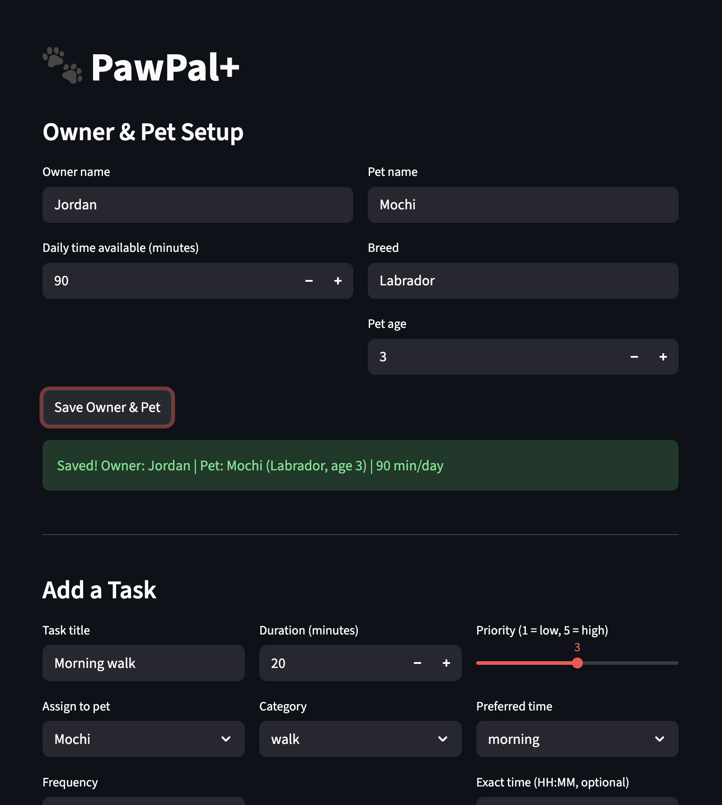
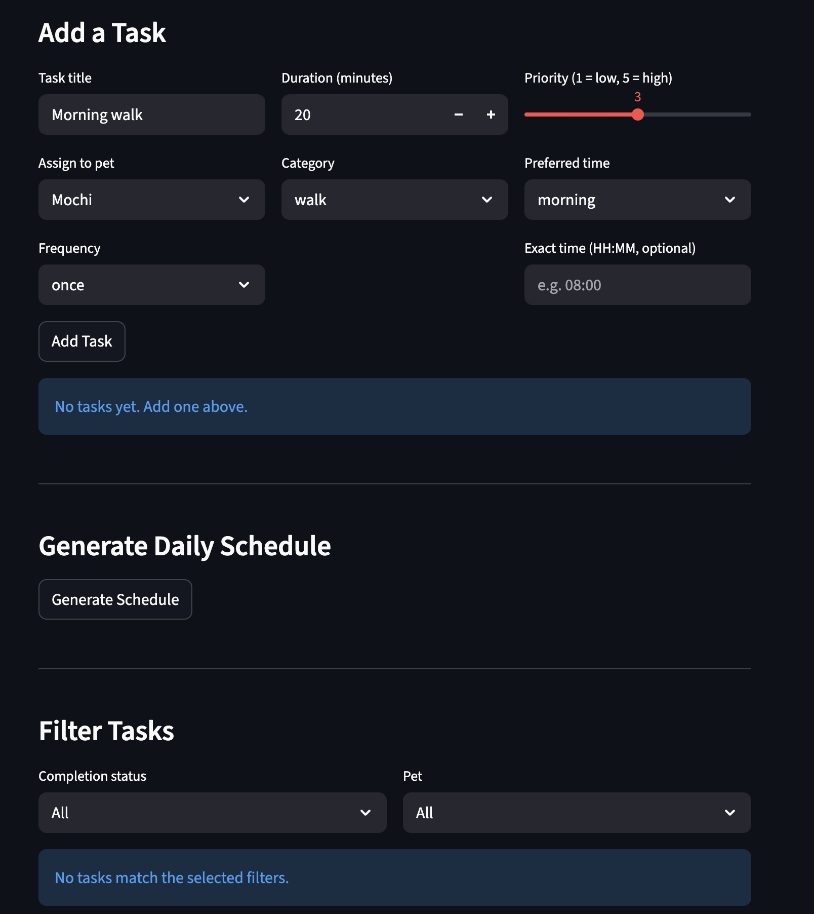

# PawPal+ (Module 2 Project)

You are building **PawPal+**, a Streamlit app that helps a pet owner plan care tasks for their pet.

## Scenario

A busy pet owner needs help staying consistent with pet care. They want an assistant that can:

- Track pet care tasks (walks, feeding, meds, enrichment, grooming, etc.)
- Consider constraints (time available, priority, owner preferences)
- Produce a daily plan and explain why it chose that plan

Your job is to design the system first (UML), then implement the logic in Python, then connect it to the Streamlit UI.

## What you will build

Your final app should:

- Let a user enter basic owner + pet info
- Let a user add/edit tasks (duration + priority at minimum)
- Generate a daily schedule/plan based on constraints and priorities
- Display the plan clearly (and ideally explain the reasoning)
- Include tests for the most important scheduling behaviors

## Getting started

### Setup

```bash
python -m venv .venv
source .venv/bin/activate  # Windows: .venv\Scripts\activate
pip install -r requirements.txt
```

## Features

| Feature | Description |
|---|---|
| **Priority-based scheduling** | Tasks are ranked 1–5; the daily plan fills available time starting from highest priority. |
| **Sorting by time of day** | `Scheduler.sort_by_time()` orders tasks morning → afternoon → evening → anytime, with priority as a tiebreaker within each slot. |
| **Flexible filtering** | `Scheduler.filter_tasks()` returns tasks filtered by completion status, pet name, or both simultaneously. |
| **Daily & weekly recurrence** | Tasks with `frequency="daily"` or `"weekly"` auto-generate the next occurrence when marked complete, with the correct next due date. |
| **Conflict detection** | `Scheduler.detect_conflicts()` flags any two pending tasks that share the same exact time string (e.g., `"08:00"`), returning warning messages without crashing the app. |
| **Explanatory plan output** | `Scheduler.explain_plan()` produces a plain-English summary of what was scheduled and what was skipped, and why. |

## Challenge: Weighted Scheduling

Beyond basic priority ranking, PawPal+ includes a **composite weighted scoring** algorithm (`Task.compute_weighted_score()` + `Scheduler.generate_weighted_plan()`) that factors in four signals simultaneously:

| Signal | Points | Reasoning |
|---|---|---|
| User priority × 10 | 10–50 | Preserves the owner's explicit intent |
| Category urgency | 0–30 | Medication (30) > feeding (20) > hygiene (15) > walk (10) > grooming/enrichment (5) |
| Overdue bonus | +25 | Any task past its due date gets bumped regardless of priority |
| Recurrence bonus | +3–5 | Daily habits outrank one-time tasks at the same score level |

This means an overdue priority-3 medication (score: 30 + 30 + 25 = 85) correctly outranks a non-urgent priority-4 grooming session (score: 40 + 5 = 45) in the final plan — something raw priority sorting cannot achieve.

### How Agent Mode was used to implement this

Agent Mode (Claude Code) was given a single instruction in `steps.txt`: *"Add a third algorithmic capability (like 'next available slot', weighted prioritization, etc.) that goes beyond the basic requirements."*

The agent:
1. **Read the existing codebase** (`pawpal_system.py`, `tests/test_pawpal.py`, `README.md`) to understand what algorithms already existed before proposing anything new.
2. **Designed the scoring formula** — it identified that raw priority alone cannot differentiate between a skipped medication and an optional grooming session, and proposed a multi-signal weighted score to address that gap.
3. **Implemented in layers** — added `_CATEGORY_WEIGHT` constants first, then `compute_weighted_score()` on `Task`, then `generate_weighted_plan()` on `Scheduler`, keeping each change small and reviewable.
4. **Wrote three targeted tests** covering: category weight difference, overdue bonus value, and an end-to-end case where a lower-priority overdue task correctly beats a higher-priority non-urgent one.

Key prompt that worked well: providing a structured `steps.txt` file with explicit, bounded tasks rather than open-ended instructions. This prevented the agent from over-engineering or going off course.

## Smarter Scheduling

Phase 4 adds three new capabilities to the scheduler:

- **Sort by time of day** — `Scheduler.sort_by_time()` orders any task list by preferred time slot (morning → afternoon → evening → anytime), with priority as a tiebreaker within each slot.
- **Flexible filtering** — `Scheduler.filter_tasks(completed, pet_name)` lets you retrieve only pending or completed tasks, optionally scoped to a single pet.
- **Recurring tasks** — Tasks now have a `frequency` field (`"once"`, `"daily"`, `"weekly"`). Calling `Scheduler.mark_task_complete(task, pet)` marks the task done and automatically appends the next occurrence (with the correct due date) to the pet's task list.
- **Conflict detection** — `Scheduler.detect_conflicts()` scans tasks for exact time-string collisions (e.g., two tasks both set to `"07:30"`) and returns human-readable warning messages without crashing the program.

### Suggested workflow

1. Read the scenario carefully and identify requirements and edge cases.
2. Draft a UML diagram (classes, attributes, methods, relationships).
3. Convert UML into Python class stubs (no logic yet).
4. Implement scheduling logic in small increments.
5. Add tests to verify key behaviors.
6. Connect your logic to the Streamlit UI in `app.py`.
7. Refine UML so it matches what you actually built.

## Testing PawPal+

### Run the test suite

```bash
python -m pytest
```

### What the tests cover

| Test | What it checks |
|------|---------------|
| `test_mark_complete_changes_status` | `mark_complete()` flips `completed` to `True` |
| `test_add_task_increases_pet_task_count` | `Pet.add_task()` appends to the task list |
| `test_sort_by_time_chronological_order` | `sort_by_time()` orders slots morning → afternoon → evening → anytime |
| `test_sort_by_time_priority_tiebreaker` | Within a time slot, higher-priority tasks appear first |
| `test_daily_recurrence_creates_next_day_task` | Completing a daily task creates a new task due the following day |
| `test_weekly_recurrence_creates_next_week_task` | Completing a weekly task creates a new task due the following week |
| `test_once_task_returns_no_next_task` | One-time tasks return `None` on completion (no recurrence) |
| `test_detect_conflicts_flags_duplicate_times` | `detect_conflicts()` returns a warning when two tasks share the same time string |
| `test_detect_conflicts_no_false_positives` | Tasks at distinct times produce no conflict warnings |
| `test_detect_conflicts_ignores_completed_tasks` | Completed tasks are excluded from conflict detection |

### Confidence Level

★★★★☆ (4/5)

The core scheduling behaviors like sorting, recurrence, and conflict detection are well-covered and all tests pass. The main gap is integration-level testing (e.g., end-to-end plan generation with a mix of constraints, and the Streamlit UI layer), which would push confidence to 5/5.

## Demo



