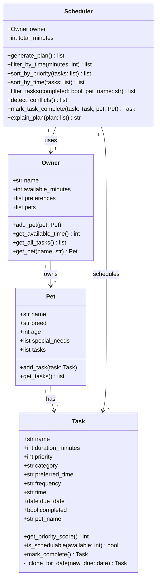

# PawPal+ Project Reflection

## 1. System Design

**Three core user actions:**

1. **Add a pet and owner info** — The user enters their name, daily time available, and preferences, then registers their pet (name, breed, age, special needs).
2. **Add and edit care tasks** — The user creates tasks like walks, feeding, or medication, each with a duration and priority level.
3. **Generate a daily plan** — The user requests a scheduled plan; the system fits tasks into available time slots ranked by priority and explains the reasoning.

**Mermaid.js Class Diagram:**

**a. Initial design**

The system is built around four classes:

- **Task** — the atomic unit of the app. It holds a task's name, duration, priority (1–5), category (walk/feeding/medication/etc.), and a preferred time of day. It knows whether it fits in a given time window (`is_schedulable`) and can report its priority score.
- **Pet** — stores the pet's profile (name, breed, age, special needs) and owns the list of associated `Task` objects. It is responsible for managing task membership.
- **Owner** — stores the owner's name, total daily minutes available, and personal preferences. It holds a reference to one `Pet` and exposes the available time for the scheduler to consume.
- **Scheduler** — the core logic class. It takes an `Owner` (and by extension the pet's tasks), filters tasks that fit within available time, sorts by priority, builds the final daily plan, and generates a plain-English explanation of its choices.

The relationship chain is: `Owner` → `Pet` → `Task`s, with `Scheduler` orchestrating the plan generation using `Owner` as its entry point.

**b. Design changes**

Yes, one change was made after reviewing the design for bottlenecks.

**Change:** The `Scheduler` originally held its own `tasks` list as an attribute, separate from `Pet.tasks`. This would create a sync problem: tasks added to the `Pet` after the `Scheduler` was constructed would not be visible to the plan generator.

**Fix:** Removed the duplicate `tasks` attribute from `Scheduler`. Instead, `generate_plan` (and related methods) will source tasks directly from `owner.pet.get_tasks()` at call time. This ensures the scheduler always works from the current state of the pet's task list without requiring manual re-syncing.

---

## 2. Scheduling Logic and Tradeoffs

**a. Constraints and priorities**

- What constraints does your scheduler consider (for example: time, priority, preferences)?
- How did you decide which constraints mattered most?

**b. Tradeoffs**

The conflict detector only flags tasks whose `time` strings match exactly (e.g., both set to `"07:30"`). It does **not** check for overlapping durations — for instance, a 30-minute task at `"07:00"` and a 10-minute task at `"07:15"` would never be flagged even though they overlap in real life.

This is a reasonable tradeoff for a lightweight daily planner. Requiring exact-match detection keeps the algorithm O(n) with a single dictionary pass and avoids false positives for tasks that are merely in the same rough time window. For most pet-care tasks, the owner already knows approximate slot boundaries, so an exact-time clash is the most actionable signal to surface. A full overlap check would need start/end times for every task, adding complexity and more required data from the user.

---

## 3. AI Collaboration

**a. How you used AI**

- How did you use AI tools during this project (for example: design brainstorming, debugging, refactoring)?
- What kinds of prompts or questions were most helpful?

I used AI to brainstorm ideas and then I told it what to focus on and write the implementation for that. It helped in all areas of development from writing the code, debugging, refactoring, and testing. What was useful was creating a .txt file that I used to write the TODOs of what I wanted the implement. Having a structure and step by step process prevented it from going off course and trying to complete too much at once which can cause hallucinations.

**b. Judgment and verification**

- Describe one moment where you did not accept an AI suggestion as-is.
- How did you evaluate or verify what the AI suggested?

One moment where I did not accept AI was when it created the stucture for owners and pets, the AI went under the assumption that the an owner can only have one pet which is incorrect so when I saw that, I had the AI rewrite the code with this consideration in place. I evaluated based on my understanding of the logic and by running tests and observing the output in main. Through that I found issues such as the prioritization scheduling taking into account tasks that had already been completed.

---

## 4. Testing and Verification

**a. What you tested**

- What behaviors did you test?
- Why were these tests important?

The test suite covers three critical areas:

1. **Sorting correctness** — `sort_by_time()` is tested to confirm tasks come back in chronological slot order (morning → afternoon → evening → anytime) and that priority breaks ties within the same slot. This matters because a mis-ordered schedule would confuse the owner even if all tasks were present.

2. **Recurrence logic** — Tests confirm that marking a `daily` task complete produces a new task due the next day, a `weekly` task produces one due the next week, and a `once` task returns `None`. These are important because a bug here would silently drop recurring tasks from the schedule — the kind of failure that only shows up days later.

3. **Conflict detection** — Tests verify that two tasks sharing the same time string trigger a warning, that tasks at distinct times don't, and that completed tasks are excluded from the check. Without these, the conflict detector could either miss real clashes or surface false alarms that erode the owner's trust in the app.

**b. Confidence**

- How confident are you that your scheduler works correctly?
- What edge cases would you test next if you had more time?

Confidence: ★★★★☆ (4/5). The unit-level behaviors are well-covered and all tests pass. Given more time, I'd add:

- **Overlapping duration conflicts** — two tasks whose start times and durations overlap even if the start strings differ (e.g., a 30-min task at `"07:00"` and a 10-min task at `"07:15"`).
- **`generate_plan` with a tight time budget** — verify that tasks are greedily selected in priority order and that the total duration never exceeds `available_minutes`.
- **Multi-pet scheduling** — confirm that `get_all_tasks()` and `filter_tasks(pet_name=...)` correctly isolate tasks when an owner has more than one pet.
- **Zero available time** — ensure `generate_plan` returns an empty list rather than crashing.

---

## 5. Reflection

**a. What went well**

- What part of this project are you most satisfied with?

I'm very satisfied with how the project turned especially with converting a system design into a fully functioning product.

**b. What you would improve**

- If you had another iteration, what would you improve or redesign?

I would improve the conflict detection to handle overlapping durations rather than only exact time-string matches. For example, a 30-minute task at `"07:00"` and a 15-minute task at `"07:20"` overlap in real life but currently pass through undetected. I'd also redesign the Streamlit UI to make the task list editable in-place rather than requiring re-entry, which would make the app feel more like a real tool and less like a demo.

**c. Key takeaway**

- What is one important thing you learned about designing systems or working with AI on this project?

The most important thing I learned is that structure given to AI directly impacts the quality of its output. By keeping a `steps.txt` file that broke the project into small, focused phases, I was able to use AI as a reliable implementation partner rather than a source of sprawling, hard-to-verify suggestions. Good system design and good AI collaboration turned out to require the same skill, just breaking a complex problem into clear, bounded pieces before writing a single line of code.
